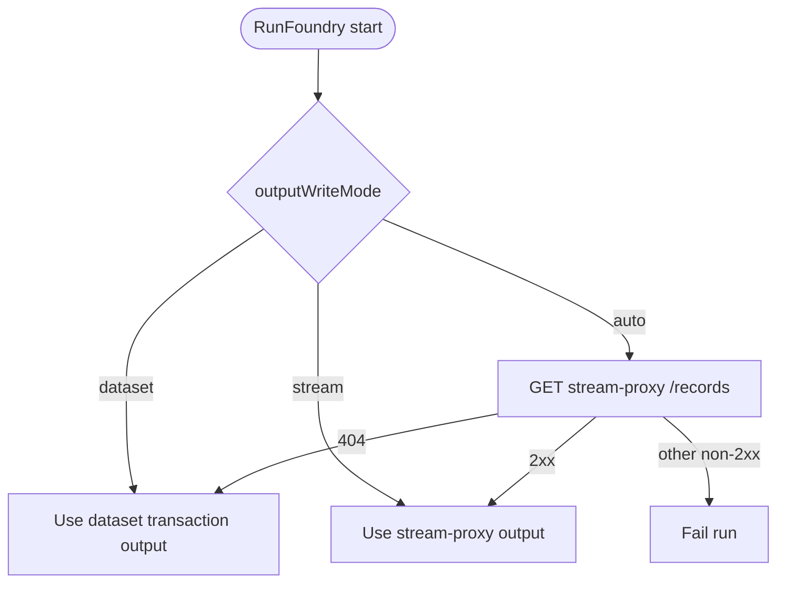
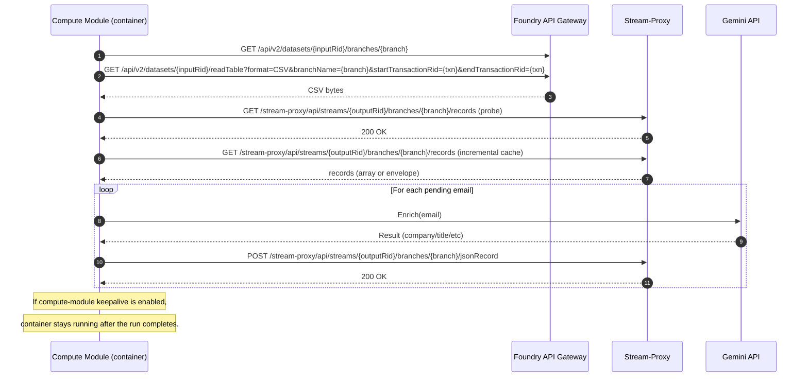
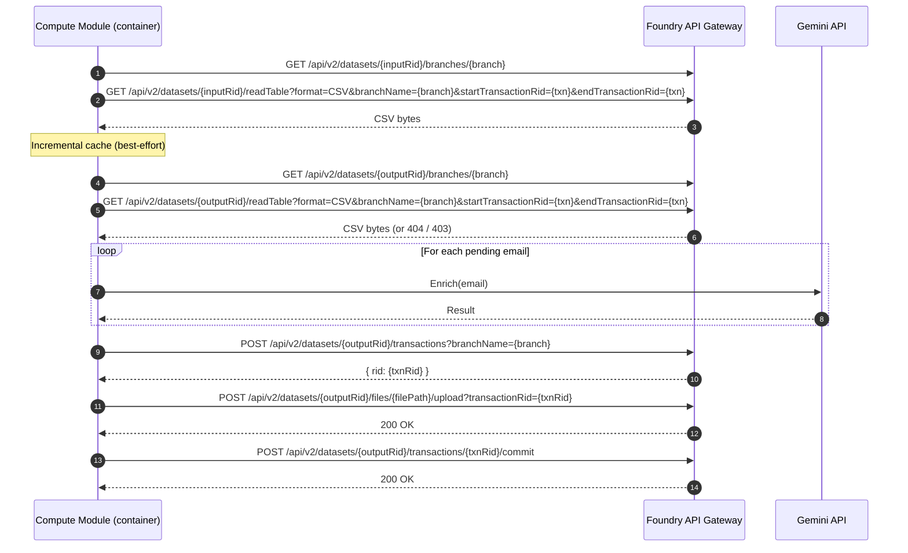
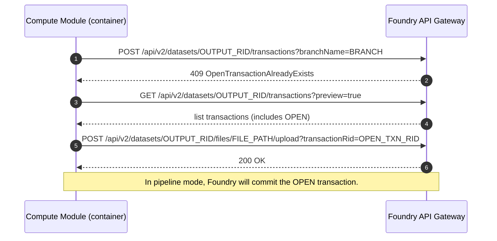
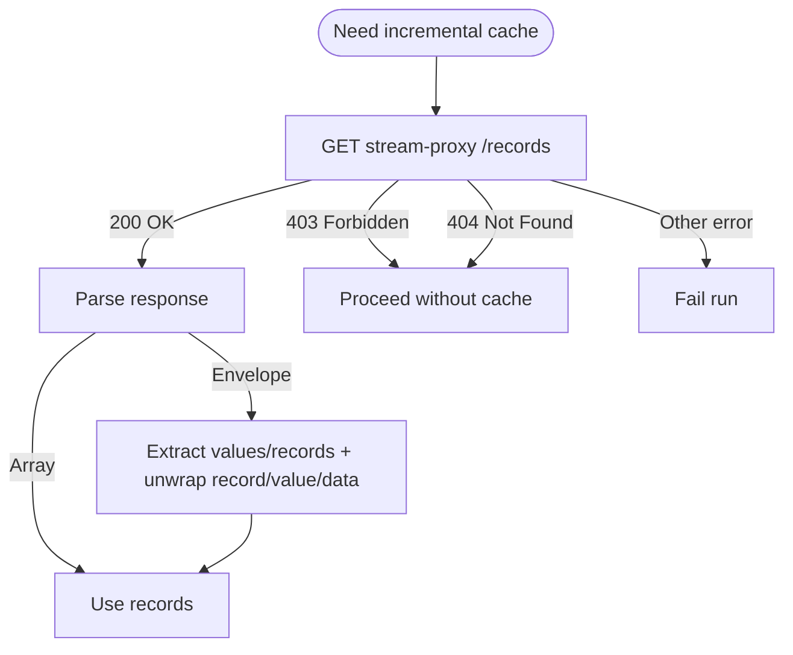

# Diagrams

This document contains Mermaid diagrams for how the module uses Foundry-like APIs in different scenarios.

Notes:

- The code in this repo uses a deliberately minimal HTTP surface area.
- `pkg/mockfoundry/...` is "Foundry-like" for local harnesses and tests; it is not a full-fidelity emulator.
- Stream-proxy response shapes can vary by stack/version; the client parses a few common envelope shapes best-effort.

## Output Mode Resolution (auto|dataset|stream)

## Scenario: Foundry Run (Stream Output, Incremental)

This is the most common "streaming" scenario:

- Determine output is a stream via stream-proxy probing
- Read prior stream records to build an incremental cache keyed by `email`
- Enrich only the emails not already present with `status=ok`
- Publish one JSON record per enriched row

## Scenario: Foundry Run (Dataset Output, Transaction Flow)

Dataset mode writes a full snapshot file into a dataset transaction.

## Scenario: Dataset Output with Pre-existing OPEN Transaction

In Foundry pipeline mode, the platform may create the output transaction before starting the module.
In that case, creating a new transaction can conflict.

## Scenario: Stream Incremental Cache Read Failures

## Mock Foundry API Surface (Local Harness)

The "mock Foundry" server is implemented in:

- `cmd/mock-foundry/main.go`
- `pkg/mockfoundry/server.go`

It supports:

- Debug endpoints (dev/test visibility)
  - `GET /__debug/health`
  - `GET /__debug/calls` (records every request path/method)
  - `GET /__debug/uploads` (what files were uploaded into txns)
  - `GET /__debug/streams` (current in-memory stream records)

- Dataset API (v2)
  - `GET  /api/v2/datasets/{rid}/branches/{branchName}`
  - `GET  /api/v2/datasets/{rid}/readTable` (serves CSV)
  - `GET  /api/v2/datasets/{rid}/transactions?preview=true` (list txns; preview-gated)
  - `POST /api/v2/datasets/{rid}/transactions` (create txn)
  - `POST /api/v2/datasets/{rid}/files/{filePath...}/upload?transactionRid={txn}` (upload file into txn)
  - `POST /api/v2/datasets/{rid}/transactions/{txn}/commit` (commit txn)

- Dataset API (v1, minimal/back-compat)
  - `GET /api/v1/datasets/{rid}/readTable`
  - `PUT /api/v1/datasets/{rid}/transactions/{txn}/files/{path...}`

- Stream-proxy API (optional; only for stream RIDs registered via `MOCK_FOUNDRY_STREAM_RIDS`)
  - `GET  /stream-proxy/api/streams/{rid}/branches/{branch}/records`
  - `POST /stream-proxy/api/streams/{rid}/branches/{branch}/jsonRecord`

Authorization:

- The mock server can enforce `Authorization: Bearer <token>` when configured.

### Are these identical to real Foundry APIs?

No.

They are "Foundry-like" in path + method so the module can be tested end-to-end locally.
Behavior and response schemas are intentionally simplified.

Examples of differences:

- `readTable` is just "fixture CSV or last committed bytes"; it does not implement real Foundry table semantics.
- `branches/{branch}` returns a best-effort transaction RID (or a stable dummy value).
- Transaction listing uses simplified preview gating and transaction selection.
- Stream-proxy is an in-memory append/list implementation; it is not a real stream service (no cursors, limits, retention, authz model, etc.).
